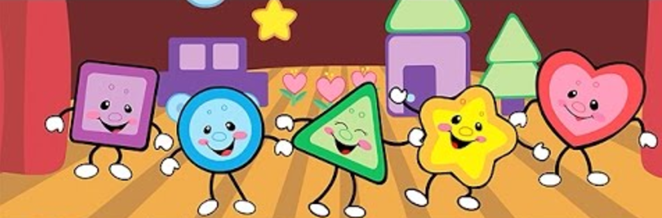

# ES6 Classes Lab

Practice ES6 by creating shape classes.

To get started run
`npm install`

and then `open test/runner.html`

`Shape` is at the top of the class hierarchy.  `Triangle` and `Rectangle` inherit directly from `Shape`.  `Square` inherits directly from `Rectangle`.

Get the tests to pass by editing the `src` files in the following order:

* `shape.js`
* `triangle.js`
* `rectangle.js`
* `square.js`

Use the code comments and tests to guide you. Run them in Chrome. (`test/runner.html`)

To get started run
`npm install`

and then
`open test/runner.html`

Do **NOT** edit the test files.

